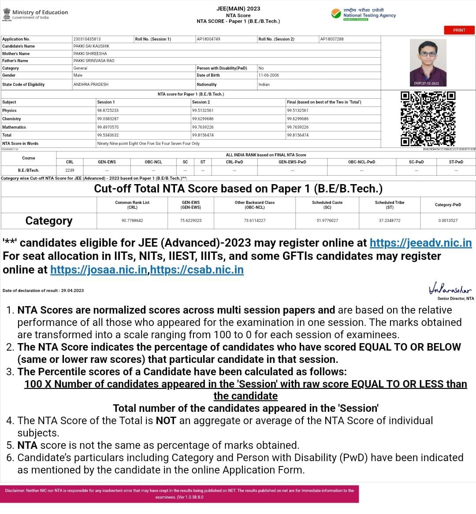
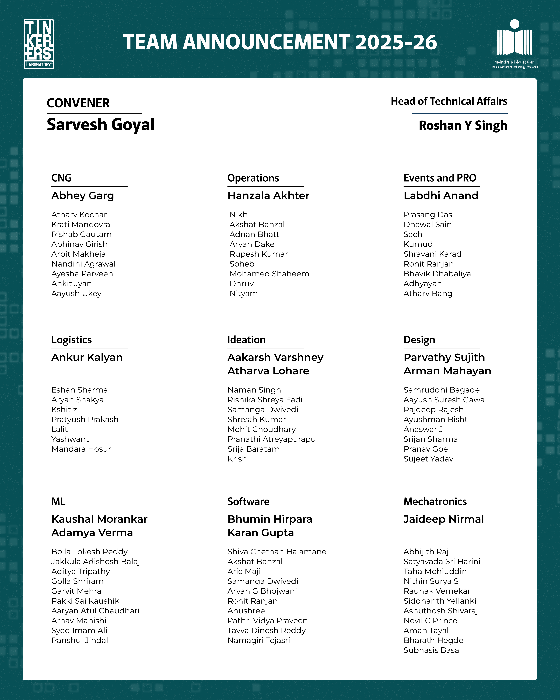
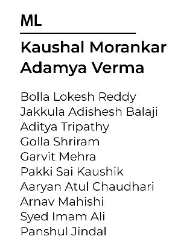
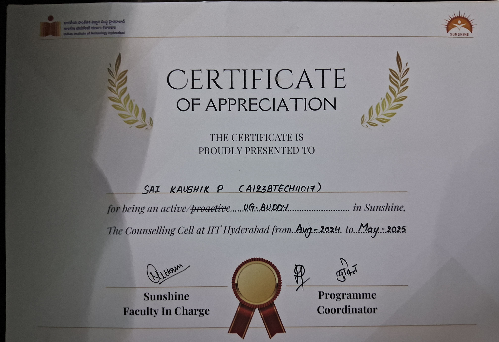

# Projects 

1. Riscv-simulator:  [version 1](https://github.com/saikaushhikp/CS2323-Carch/tree/main/Lab4)  , [version 2](https://github.com/saikaushhikp/CS2323-Carch/tree/main/Lab7)  

- in case the above links doesn't open, -> complete repo [CS2323-Carch](https://github.com/saikaushhikp/CS2323-Carch)  

2. Machine Learning Algorithms from Scratch :  [version 1](https://github.com/saikaushhikp/Supervised-Learning-Scratch)

3. Deep Learning-Based Coin Classification : [version 1](https://github.com/saikaushhikp/CNN-based-Coin-Image-Classifier)

4. Full-Stack Inventory Management System (IMS) :  [full repo](https://github.com/NagaRohithKumarJakkala/IMS)

5. Applied stats course group projects :  

- [Global Quality of Life Analysis](https://github.com/saikaushhikp/Applied-Stats-projects/tree/main/project1)  
- [Graduate Admission Prediction Analysis](https://github.com/saikaushhikp/Applied-Stats-projects/tree/main/project2)  

- in case the above links doesn't open -> complete repo [Applied Stats-Projects](https://github.com/saikaushhikp/Applied-Stats-projects)  

6. KNN on Abalone Dataset -> [link](https://github.com/saikaushhikp/AI1104-Programming-for-AI/blob/main/AI1104%20Project%20Q3.py)  
the complete repo -> [link](https://github.com/saikaushhikp/AI1104-Programming-for-AI)

---
---

# Ranks
1. Jee Adv  : 

2. Jee mains : 

3. AP EAMCET :

---
i think i lost my AP EAMCET rank card, so i am not able to upload it here, i'll try to get it soon

---
---

# Club positions

1. Ml-Core | Tinkeres' lab IITH
  

2. UG buddy | Sunshine IITH  

---
---

# extra curriculars 
1. NSS student volenteer :

---